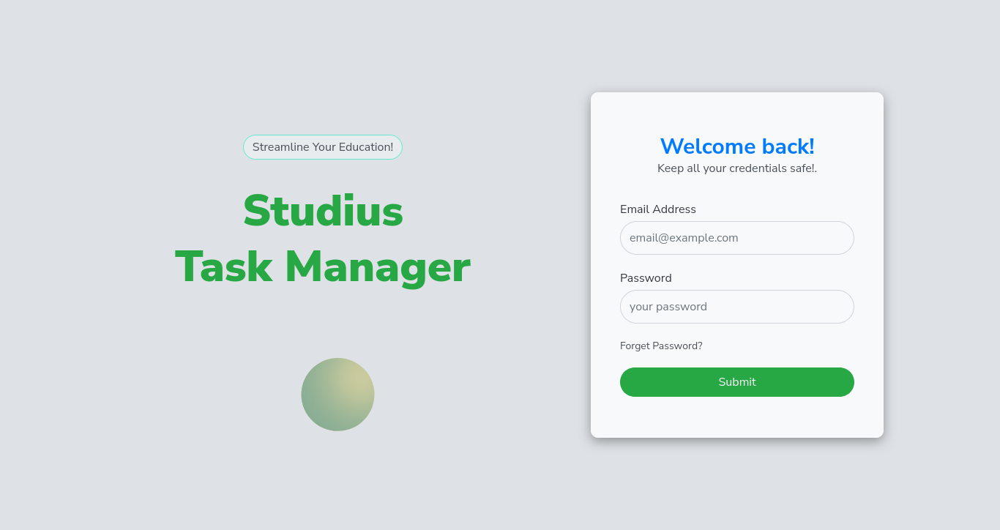
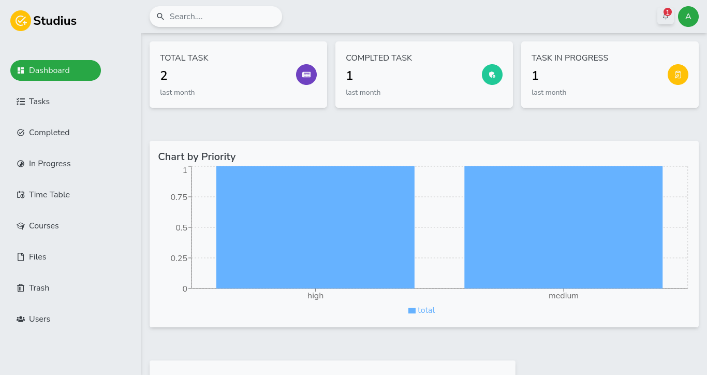

# Screenshots of the UI

### Login

### Reset Password

### Dashboard
 

### Task page (default)

### Task page (list)
.png)

### Add a new Task

### Task activities

### Task details

### Completed tasks

### Inprogress tasks

### Course Page

### Add a new Course

### File Details Page

### Add a new File
.png)

### User Data

### Add a new User

### Update user details(self)
.png)

### Update user details(others)
.png)

### User Profile

### Calender (without events)
.png)

### Add a new event

### Calender (with events)
.png)

### Detele item(any)
.png)

### Trashed items
